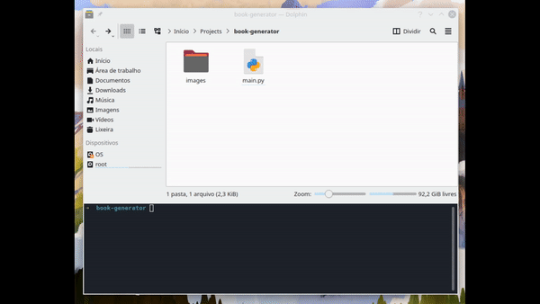

# Booklet Generator
This python script generates a booklet from a PDF file

  
Using Game Programming Patterns by Robert Nystrom to demonstrate

## Usage
```
$ python3 main.py
```

It will ask for a file name and how many pages your book has

### Attention!
The number of pages must be divisible by 4, because booklets require the number of pages to be a multiple of 4.

## Printing
Print the back pages first and then use the printed papers to print front pages behind